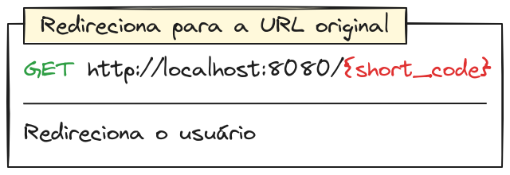
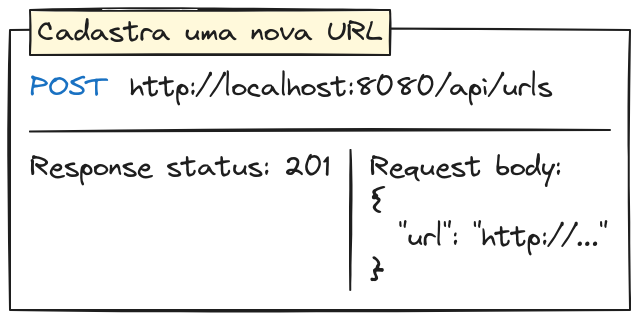
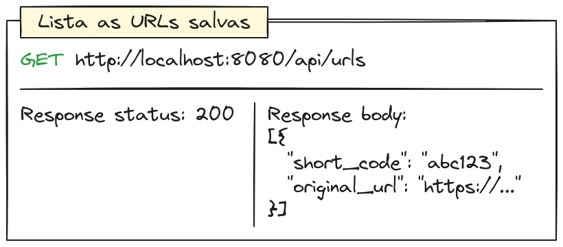
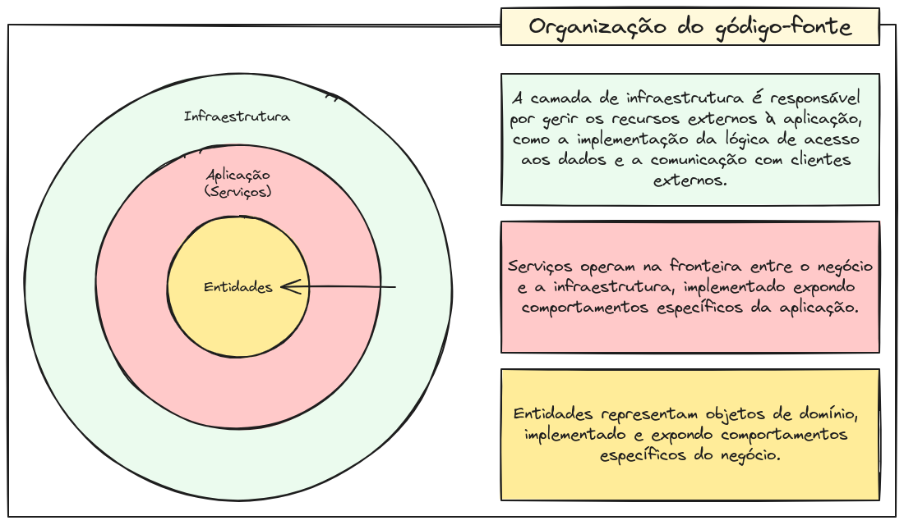

# Programação backend em Go: Introdução e exemplos práticos para iniciantes

### Convenções e instrumental

1. Módulos com nome em minúsculo, sem caracteres especiais;
2. Variáveis em _camel case_;
3. Arquivos em _sneak case_.

Ferramentas de indentação são fornecidas pela própria linguagem. Removendo a necessidade de softwares como Prettier e
ESLint, do ecossistema JavaScript.

### Proposta de desenvolvimento

O sistema proposto é um clássico das entrevistas de _system-design_, foi desenvolvido um encurtador de URLs. A
aplicação irá seguir a seguinte estrutura:

Apenas três rotas foram desenvolvidas. Uma encarregada por redirecionar o usuário para o site desejado, outra para
cadastrar o _link_ de redirecionamento e finalmente, uma que lista os _links_ cadastrados.

O código-fonte segue a seguinte estrutura:

A estrutura do sistema foi inspirada nos conceitos do livro Arquitetura Limpa, a ponto de o diagrama exibido ser muito
semelhante ao apresentado pelo autor.

O código-fonte foi dividido em três camadas. No centro, estão as entidades que representam os objetos de domínio,
implementando e expondo comportamentos específicos do negócio. Por exemplo, em um sistema de vendas, a classe NotaFiscal
seria responsável por calcular o ICMS. Idealmente, as entidades não possuem conhecimento dos mecanismos de persistência
e comunicação, mas sim das regras de domínio.

Mais externamente, encontram-se os serviços que operam na fronteira entre o negócio e a infraestrutura, expondo
comportamentos específicos da aplicação. Funcionam como uma camada intermediária, orquestrando entidades e objetos
auxiliares para garantir o comportamento adequado da aplicação.

Finalmente, na camada mais externa, é implementada a camada de infraestrutura. Esta é responsável por administrar os
recursos externos à aplicação. Bons exemplos de responsabilidades desta camada incluem a implementação de interfaces
definidas pelas camadas internas, como abstrações da lógica de acesso a dados, e a gestão da comunicação com os clientes
externos.

### Pacotes utilizados

A linguagem de programação Go, por ser extremamente recente, possui um instrumental nativo que atende muito bem às
necessidades do desenvolvimento moderno. Em projetos desenvolvidos com essa linguagem, não é comum encontrar um grande
número de dependências, como ocorre em linguagens como Python, Java ou Ruby.

Funcionalidades como testes, _logs_ estruturados, serialização para JSON, CSV ou XML, roteamento HTTP completo e suporte
a bases de dados SQL são exemplos de ferramentas oferecidas pelas bibliotecas nativas da linguagem.

Com isso em mente, para o desenvolvimento do projeto, não foram utilizados pacotes externos. O instrumental oferecido
nativamente atenderá às necessidades do programa.
