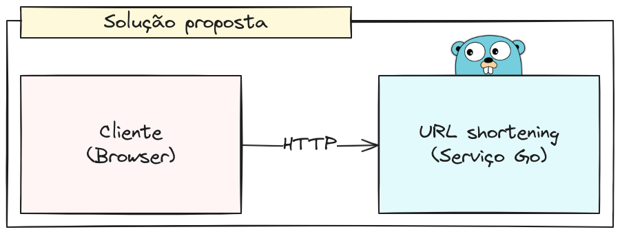

# Programação backend em Go: introdução e exemplos práticos para iniciantes

Código-fonte apresentado no minicurso Uni-FACEF 2024.

### Convenções e instrumentação

1. Módulos com nome em minúsculas, sem caracteres especiais;
2. Variáveis em _camel case_;
3. Arquivos em _sneak case_.

Ferramentas de indentação são fornecidas pela própria linguagem, eliminando a necessidade de softwares como Prettier e
ESLint do ecossistema JavaScript.

### Proposta de desenvolvimento

O sistema criado é um clássico das entrevistas de _system-design_: um encurtador de URLs. A aplicação segue a seguinte
estrutura:

Foram desenvolvidas apenas três _endpoints_: uma para redirecionar o usuário para o site desejado, outra para cadastrar
o _link_ de redirecionamento e finalmente, uma que lista os _links_ cadastrados.

 
 
 

### Estrutura do sistema

A estrutura da aplicação foi inspirada nos conceitos do livro "Arquitetura Limpa". O diagrama a seguir ilustra a
organização do software, semelhante ao apresentado pelo autor:

O código-fonte foi dividido em três camadas. No centro estão as entidades que representam os objetos de domínio,
implementando e expondo comportamentos específicos do negócio. Por exemplo, em um sistema de vendas, a entidade
NotaFiscal seria responsável por calcular o ICMS. Idealmente, as entidades não possuem conhecimento dos mecanismos de
persistência e comunicação, mas sim das regras de domínio.

Mais externamente, encontram-se os serviços que operam na fronteira entre o negócio e a infraestrutura, expondo
comportamentos específicos da aplicação. Funcionam como uma camada intermediária, orquestrando entidades e objetos
auxiliares para garantir o comportamento adequado da aplicação.

Finalmente, na camada mais externa, é implementada a infraestrutura. Esta é responsável por administrar os recursos
externos à aplicação. Bons exemplos de responsabilidades desta camada incluem a implementação de interfaces definidas
pelas camadas internas, como abstrações da lógica de acesso a dados, e a gestão da comunicação com os clientes externos.

### Pacotes utilizados

A linguagem de programação Go, por ser extremamente recente, possui um instrumental nativo que atende muito bem às
necessidades do desenvolvimento moderno. Em projetos criados com essa linguagem, não é comum encontrar um grande número
de dependências, como ocorre em linguagens como Python, Java ou Ruby.

Funcionalidades como testes automatizados, logs estruturados, serialização para JSON, CSV ou XML, roteamento HTTP e
suporte a bases de dados SQL são exemplos de ferramentas oferecidas pelas bibliotecas nativas da linguagem.

Com isso em mente, para o desenvolvimento do projeto, não foram utilizados pacotes externos. O instrumental oferecido
nativamente atende às necessidades do programa.
